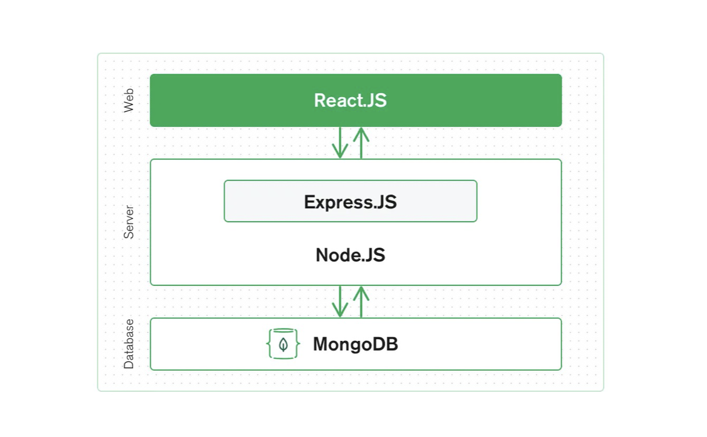

# T3A1 - Workbook
#### Mia Benn
##### Due date: 12 Nov 2022

### Q1 Provide an overview and description of a standard source control process for a large project

 Typically in large projects a source code management system such as Git will be used for source control of the code base of the project. If using Git, the entire code base will be added to a main ‘repository’. Each developer working on the code will then create their own copy of this repository, known as a branch that they can work with on their local device, independently from the stable version of the main codebase. 

They will make changes and implement features as necessary, according to their responsibilities in the team. Roles of the team may be split into front-end and back-end developers, and each developer will be given certain features that they are responsible for implementing in the application. Once their changes are ready, they can then save that set of changes, by using commands `git add .` (To add all of their changes to the staging area), `git commit -m “relevant message”` to actually commit their changes to history. When they add a commit, Git saves the code at that stage in time, with details about what exact changes were made to which file, as well as details about the time when the code was saved and the ‘author’ (member of the team) who made the changes. When the changes are finalised and approved, they can be pushed and merged back to the main code base. (AWS, 2022). 

The process effectively allows those working on the project are able to track code changes, see entire history for their code and others code in their team and revert the project to previous versions if necessary (AWS, 2022). It also allows for the main codebase to remain unaffected by changes, including mistakes that individual contributors to the project may make when implementing new features. 

### Q2 What are the most important aspects of quality software?
CISQ (the Consortium for Information & Software Quality), has defined a set of software standards that are broken into four key characteristics: Reliability, Security, Performance Efficiency and Maintainability (CISQ, 2022). The new standard for software quality standards is the ISO 5055(CISQ, 2022). All of the information in the following listed characteristics have been drawn directly from the CISQ website which details software engineering rules contained within each requirement for quality, for both the ‘coding practices at unit level’ and ‘architectural practices at system level’.
- The **reliability** software characteristic, at the coding practices level involves protecting state in multi threaded environments, safe use of inheritance and polymorphism. Also managing allocated resources, time outs. At the architectural practices system level, it requires multi layer design compliance and that the software manages data integrity and consistency as well as exception handling through transactions and class architecture compliance.
- The **performance efficiency** at a coding unit level requires compliance with Object-Oriented best practices - this means… It requires compliance with SQL best practices. Compliance with garbage collection best practices. At an architectural level, the code must interact appropriately with any remote resources. It must have adequate memory, network and disk space management. As well as centralised handling of client requests, meaning a centre point of interaction between the organisations employees and business partners or customers in order to efficiently resolve queries - this could be achieved through an IT service desk (ProProfs, 2022).
- **Security**. At a code unit level, the software mustn’t contain use of hard-coded credentials. To be considered a secure site, it is required that the code is adequately protected against SQL injections and cross-site scripting which must be achieved by adequately validating  any user input. It must also have secure architecture design compliance. It also contains requirements pertaining to buffer overflows, missing initialisation and improper validation of array indexes.
- **Maintainability**. Code should not be unstructured or unnecessarily duplicated. Some ways in which the code could breach the maintainability requirement are: hard coding of literals, over parameterisation of methods or excessive component size. The architectural design should not have duplicated business logic, and the code overall should comply with the initial architecture design. There should be a strict hierarchy of calling between architectural layers.

Measuring software according these standards determines how trustworthy, dependable and resilient a software system will be (CISQ, 2022) and measures the internal structure of any software project on the four business critical factors mentioned above.


### Q3 Outline a standard high level structure for a MERN stack application and explain the components


A MERN stack application consists of the four main technologies: MongoDB, Express.JS, React and Node.JS. The tech stack makes up a standard three-tier architecture, which consists of a front end/display tier, back end/application tier and database tier (MongoDB, 2022).  

The web tier (which can also be referred to as the front end of the app), is made using React. It’s responsible for controlling what a user can interact with on the screen and renders to the screen (in HTML) a dynamic user interface that a user can interact with, which will update with dynamic data when the user performs actions. The React front end will contain Components, Service and Navigation/Router. React needs to handle which requests are made when a user performs an action such as clicking a button, deleting a comment or entering something into an input box and it does this through communicating with the backend. 

When a user performs an action, an HTTP request is sent by React through to the back-end of the app for Express.JS and Node.JS to handle.  Express.JS and Node.JS are used to create the middle tier, also known as the application tier or backend. The backend structure contains a router, controller and model. NodeJS is a JavaScript run-time which is used to create server-side JS applications (YakoHere, 2020). It is used to receive requests and send back responses, execute server-side logic and interact with the database (YakoHere, 2020). Express.JS is a Node.JS framework which adds additional functionality and wraps HTTP requests or responses (MongoDB, 2022). The server is able to communicate with the Database tier, which uses MongoDB to store all user data relating to the application - as this is a noSQL database, it stores data as documents. 

MongoDB is designed to store JSON data (which is technically uses BSON, a binary version of JSON, however it sends back data in JSON format) (MongoDB, 2022). When the Server needs to make any changes or retrieve any information from the database, it does this by sending JSON data back and forth between the Server and Database tiers. After the back-end has processed any given request and performed any necessary communication with the database, it sends back a response to React, which then updates the user interface on the front-end to provide instant feedback to the user that reflects the changes.


### Q4 A team is about to engage in a project, developing a website for a small business. What knowledge and skills would they need in order to develop the project?

The development team would need comprehensive knowledge of a particular tech stack. There are many different ones that could be used to create a website for a small business depending on the specific requirements of the website. For example,  Ruby on Rails, or the MERN stack could be used. They could meet the project requirements in a range of different ways, it is mostly important  however that the team knows one of these development stacks well enough to create a functional and secure website.
As they are working as a team, they will need knowledge of a source control management system such as Git and Github, where they are able to save their code in a shared repository and be able to simultaneously work on features of the site. The project features and responsibilities will be split among the team, with some developers working on the front end, some working on the back-end and particular features being implemented by different developers. By using a shared repository on GitHub, the team will be able to both see code updates from other members of the team in live time, as well as push their own changes to the repository. They can then monitor the repository throughout the build of the website, to make sure that none of their changes clash with one another, the website functions properly (especially if they are using a CI/CD pipeline), and there is no code duplication. 

In addition to the technical skills, the whole team will need to possess strong communication skills, as well as good teamwork and collaboration skills. Teamwork and collaboration skills involve qualities such as having an agreeable personality, respecting the hierarchy of the team - for example, if one person has been assigned to lead the team, it’s essential that the other team members respect this authority and do not try to control aspects of the project they are not responsible for. It also involves being able to both take and give feedback from/to other team members in a professional manner. A tool such as a Trello board could be used by the team in order to collaborate and assign tasks to one another, so utilising their chosen tool properly and keeping other team members in the loop with the progress of their responsibilities would constitute having good collaboration skills.

Not only do they need strong communication skills with other members of the team in order to ensure that all the tasks are being completed, without any missed work or duplicated work, they also need to be able to communicate effectively with the client (the small business) to ensure that their development plan and process meets the goals of the business effectively. They need to understand what the business is looking for with their website, and to understand any personal preferences that the client may have. They will need to be open to feedback from the client in order to dynamically make changes and create an end result that the client is happy with. 


### Q5 With reference to one of your own projects, discuss what knowledge or skills were required to complete your project, and to overcome challenges
*Please note: I transferred from the January intake, hence why my previous coder academy projects have been completed with Ruby on Rails and not Python.*

A recent project that I completed was an assignment for coder academy, where the brief was to create a web application using Ruby on Rails. I created a web application for service providers to list last minute appointments that became available, with full CRUD ability to create, read, update and delete appointment listings. Plenty of technical skills were required for the successful completion of the project. The project required knowledge of setting up a Ruby on Rails project and configuring it with the MVC design pattern. This included a Model connecting to a Postgresql database, a Controller with defined methods that could communicate between the View and the Model and a View that could render the pages with different appointment listings in a clear and effective way.

Documentation writing was also required, so it was necessary to learn to create professional wireframes, sitemaps and user stories for the project in order to attach these to an informative README doc that detailed specifications of the project. In addition, knowledge of the source control management Git was used to save versions of the project. It was necessary to have both the skills to use Git to save changes to the project and connect the GitHub repository to the Heroku deployment platform as well as the knowledge of what should not be uploaded to Git. For this particular project, this included sensitive information that would risk the integrity of the data if it was available publicly, such as secret keys connected to storing data in the database. 

There were many challenges to overcome while creating the application, such as version management when it came to the Ruby version that was used for the app, Ruby Gems and dependencies of the app having different versions, which resulted in errors even if the app was set up correctly. Fortunately, educators were of great assistance when it came to solving these version issues, however solving the issues effectively required good communication skills to describe the exact issue and provide relevant information such as what operating system I was using and how different software had been installed. Of course, as in any development project, many errors came up throughout the creation of the app. These ranged from basic syntax errors to more complicated logic errors. It was extremely important to have good error handling skills in these situations, and it strengthened my Google skills when it came to error handling, as well as ability to read solutions posted on websites like StackOverflow to understand how those provided solutions could be applied and modified to help solve the error I was having in my own project. I would also say that stress management was key to overcoming some challenges, so techniques such as taking a break from a particular issue to step away from the problem and return to it with a set of fresh eyes were extremely useful. 


### Q6 With reference to one of your own projects, evaluate how effective your knowledge and skills were for this project, and suggest changes or improvements for future projects of a similar nature.

My skills and knowledge relating to the project were fairly effective in creating a functional application. I had experience using HTML and CSS for the earlier portfolio project in the course, and therefore even though I had not used bootstrap or Sass before, understanding them came quite naturally by relying on knowledge gained from previous experience I had. Therefore, for the front end of the application, my knowledge and skills were effective. 

Understanding the CI/CD pipeline, and therefore connecting my app to the Heroku deployment platform early on, and continually pushing my changes to the deployed app throughout the development of the application was certainly very helpful when it came to debugging, as I was able to regularly confirm that the app was working as expected, and when it stopped working I was aware of exactly what changes I had made to the codebase between the time the app was functioning properly, and the time when it stopped working or started showing unusual errors.

One of the most challenging aspects of the project was definitely setting up the database and understanding how each table related to one another. For example, when it came to structuring the database tables with foreign keys which relate to other tables, I felt that my knowledge was not sufficient enough to create a completely normalised database. 

As with all projects in this course, the technology I was using to create it was completely new to me. Whilst I completed all of the course work on Ruby on Rails, many of the nuances of the technology were still unclear to me, which made error handling more difficult. For future projects of a similar nature, I believe that it will be important to get more practice with creating smaller, less complicated projects using the technology first so that my knowledge will be able to gradually broaden and I will be more informed when debugging more complicated projects (with more complicated error messages) with that technology. 


### Q7 Explain control flow, using an example from the JavaScript programming language

The control flow of a program is technically defined as the ‘order in which the computer executes statements in a script’ (Mozilla, 2022). In JavaScript, by default the code will run from the first line to the last line of the script, executing each statement in the order that it reads it.
An extremely basic program would look something like:

```JavaScript
isRaining = true
console.log('It’s raining outside!')
console.log('It’s not raining outside!')
```

 The above script will result in the computer reading each line as it is written, and executing every single line in order, therefore both “It’s raining outside!” And “It’s not raining outside” will be output to the console. Using control structures allows us to control the flow of this script more efficiently in order to define which lines will run depending on whether certain conditions are true, or if certain events occur. A typical program will contain many control structures that define the flow of the program depending on the value of different conditions or different actions that the user may take. Control structures in JS include things such as conditionals, loops and functions or even event listeners. We can use a conditional statement (in JS, conditional statements include ``if``, ``else``, ``else if`` and ``switch`` statements) to add a control structure to the above program, like so:

```JavaScript
isRaining = true

if (isRaining == true) {
	console.log('Its raining outside!')
} else if (isRaining == false) {
	console.log('Its not raining outside!')
} else {
	console.log('We dont know the weather, sorry!')
}
```

This allows us to control the flow of the program depending upon a boolean condition. The ``if`` statement will only run if the condition inside it is ``true``, ie ``isRaining == true`` evaluates to ``true``. Therefore, above, as ``isRaining`` is ``true``, the console will log “It’s raining outside” and the other statements will not run. If ``isRaining`` were ``false``, the statement ``isRaining == true`` would evaluate to ``false``, and that line would not run. The program would instead skip to the next statement to evaluate whether ``isRaining == false`` evaluates to ``true``. If it does, the line ``console.log('It’s not raining outside')`` will be run. The ``else`` allows us to account for any other unexpected value that the variable ``isRaining`` might be holding, and will run if none of the other conditions return true. Using the ``if`` statement in this program allows for a much more customised program which is able to return custom outputs depending on the value of the variable. 

Another JavaScript control structure example is loops, which are able to perform repeated tasks based on a condition (). When a program encounters a loop, it will stop when it gets to the loop and continually run the code with the loop until the given condition is false. 
For example, when encountering the below for loop, the program will continually evaluate the condition of ``i`` until it is no longer less than or equal to 5, resulting in the numbers 1 to 5 being printed to the console. 

```JavaScript
// Here we initialise the loop that must run so long as i<=5
for (i = 1; i <= 5; i++) {
  // this code inside the loop will continue to run until that given condition is false.
  console.log(i);
}
```

We could achieve the same result using a different type loop such as a ``while`` loop or a ``do…while`` loop, but in general loops are considered an efficient way to control the flow of the program when we need to continually run a certain block of code.

When we need to be able to reuse a certain block of code, we can create a function. We only need to create a function once and we will be able to continually use it throughout the rest of our program when it is invoked within our code or when an event occurs (such as a user clicking a button). We can call a JS function that we have created within our program by using the name of the function and a set of parentheses ``()`` , eg if our function is called ``getUserName``, we would invoke it by simply writing ``getUserName()`` . Functions are extremely useful in JS as they allow us to call the same code as many times as we need do as well as use different arguments on it, which can produce different results (W3 Schools, 2022). When our code reaches the line where the function is called or a user performa an action that invokes the function call, it will execute the code defined within the function, using any arguments it was given upon calling it, making functions an extremely useful and common way to control the flow of any type of program in JS.


### Q8 Explain type coercion, using examples from the JavaScript programming language.

Type coercion in JavaScript is essentially just the process of converting one data type to another data type. In JS, we can use comparative operators such as ``==`` and ``===`` in order to check whether two different pieces of data are equal. The double equal will perform a type coercion and the triple equals will not perform a type coercion. 

For example, say we want to find out if two different variables - a string and an integer, are equal to one another in order to run a piece of code. We could say:

```JavaScript
if ("5" == 5) {
	console.log("That number is equal to 5!");
}
```
Although we are essentially comparing a string data type to an integer data type, JavaScript will automatically perform a **type coercion**, and this expression will return true, and so the following piece of code will be run. 

We can on the other hand use a strict comparative operator, which tells JS to not perform the type coercion and require that the information on either side of the comparative operator must not only contain the same information, the data type also needs to be the same. The code for that would look like this:

```JavaScript
if ("5" === 5) {
	console.log("That number is equal to 5!");
}
```

Because we have used the ``===``, which is a strict comparative operator, the expression of ``"5" === 5`` returns false and the console.log will not run.

JavaScript is a language that performt type coercion automatically or implicitly, meaning that we as the programmer do not need to ask the program to do this in any way, it will automatically be performed for us. 

### Q9 Explain data types, using examples from the JavaScript programming language 

Data types are broadly defined as classifications that are able to specify which type of data a variable can store, and as a result which mathematical, relational or logical operations can be performed on or applied to the variable without causing errors (TechTarget, n.d). 

The data types that are built in to the JavaScript language are: 
- Strings: consisting of a string of characters. 
- Numbers: consisting of only numerical values
- BigInts: stores numbers which are too large to be stored in the Number type
- Symbols: A built-in object that has a completely unique identifier.
- Booleans: Storing a true or false value.
- Undefined: Something which has not yet been assigned a value.
- Null: The intentional absence of a value.

Variables can be created in JavaScript and assigned these data types. Using these data types allows us to perform specific operations within the language. 

For example, we can define a variable that holds a ‘string’ data type (which is a string of characters), the following way:

```let stringVariable = “hi”```

A variable containing a number data type can store numerical characters, for example:

```let numVariable = 4```

Assigning a variable a data type will change how the program stores the variable, what we can do with it and how we are able to manipulate it. For example, if we want to use the information inside the variable in a specific way, the program will behave differently depending what data type we are operating on.  We will be able to use mathematical operations on our Number data type defined above. For example, if we then run ``numVariable + 3``, our program will return ``7``. Because the same data type of a number was used, JavaScript was able to run the + addition symbol as a mathematical operator and actually interpret our instructions as an addition of 4 + 3. However, if we were to run ``stringVariable + 4``, our program would return ``hi4`` . Because the ``stringVariable`` contains a String data type, and we are trying to add a Number type, the program is unable to do so, therefore it simply performs a type coercion and concatenates the number 4 onto the end of the string as an additional character. 

Different data types also have different built-in methods that can be used on them, a commonly used one on the String data type is ``.length``, which returns the length of characters in a given string. If we were to use the ``.length`` method on our stringVariable from above by running ``stringVariable.length()``, it would successfully return ``2``, as that is the amount of characters in the word “hi” that is stored within this variable. However, if we ran ``numVariable.length()``, it would not produce the desired outcome and instead return ``undefined``, because this is not a function that can be performed on the Number type. 

### Q10 Explain how arrays can be manipulated in JavaScript, using examples from the JavaScript programming language

Arrays can be manipulated in a range of ways in JavaScript , due to the range of methods built in to the language. Some commonly utulised methods are detailed below as examples.

**Creating a new array from an existing array**
The ``map()`` method is commonly used to mutate arrays, and can be used in order to apply a given method individually to each element in an array, and create a new array with the resulting values. For example, if we have an array called cities:

```const cities = ['Melbourne', 'Sydney', 'Gold Coast', 'Los Angeles']```

And we would like to create a new array using all the existing elements within this array, we can use the map method. 

```const lowercaseCities = cities.map((x) => x.toLowerCase());```

By calling the ``map()`` method, on the ``cities`` array, we are able to iterate over the array using the variable ``x``. We then call the .toLowerCase() method on each iteration (or each element in the array) and save the result of this to a new variable called ``lowercaseCities``. By doing this we are able to create a whole new array using our cities array, without affecting or mutating the contents of the original array. Calling ``console.log`` on ``cities`` will still return ``[ 'Melbourne', 'Sydney', 'Gold Coast', 'Los Angeles' ]``, whereas if we ``console.log`` what is now stored in ``lowercaseCities``, we return ``[ 'melbourne', 'sydney', 'gold coast', 'los angeles' ]``.

**Filtering items of an array**
Another extremely useful method is filtering items of an array using the built in filter() method, which allows us to only show some elements of an array. 

Using our cities array from above, we can filter this array to return only certain elements depending upon a certain condition. If we would like to return only cities that have a character length of more than six, we could do it like so:

``const longerCities = cities.filter(city => city.length > 6)``

Calling .filter() will create a new array, containing only the filtered elements in it.

If we check to see what is stored in the variable longerCities that was created using the filter method on the cities array, the program will return ``[ 'Melbourne', 'Gold Coast', 'Los Angeles' ]``. Essentially without affecting the original cities array, we now have an array which has removed the element ``Sydney`` as the word cntains only six characters, and only returned to us in the new array the condition we specified in our filter method (``city.length > 6``). As the method iterates over the array, it checks to see if each element matches the condition and if it does not it will be filtered out.

**Joining two arrays together**
The .concat() method is useful for joining together two arrays. For example if we would like to join another array with our ``cities`` array from above, we can call the .concat() method on our cities array, using an additional array that we would like to join to the array as an argument. This will result in 

This method can be extremely useful for combining different pieces of data that are stored in different arrays for use as one array, which would make it easier to then perform additional operations to, for example any of those listed above.

**Converting an array into an Object**
8.14 of youtube vid.
It is also possible to convert our array to a different data type such as an Object, using a method like .fromEntries(). As a practical example, let's say we have a 

```JavaScript
const car = [
	['brand', 'Ford'],
	['colour', 'Red']
]
```

```const carAsObject = Object.fromEntries(car)```

Being able to manipulate an array in this way can prove extremely useful for frameworks and libraries, and in general being able to convert data. 

There are a plethora of built-in methods for arrays in JavaScript, as provided by the JavaScript documentation. In addition to these, arrays can be manipulated in more advanced ways by using loops in JS. One loop that is especially useful for use on arrays is a for/of loops.

A ``for...of`` statement will operate on a sequence of values sourced from an iterable object (MDN Web Docs, 2022) - which an Array is. It allows us to easily create a program where each element in the array will be iterated on and had a specific action performed to it. To simply log out to console each element of our cities array, we could write a ``for...of`` loop like so:

```JavaScript
for(const city of cities) {
  console.log(city)
}
```
Of course, in a more sophisticated program we can perform many more operations to each element as the loop iterates over the array.


### Q11 Explain how objects can be manipulated in JavaScript, using examples from the JavaScript programming language.

There are a multitude of built-in methods that can be used on objects in JavaScript, so I have provided a select few as examples below;

**Assigning new properties to an object**
Using the ``.assign()`` method on an object allows us to both override properties that the object already contains as well as create new ones. If we have for example a ``person`` object:

```JavaScript
const person = {
    name: 'Jack'
}
```

In order to assign a new name to the person as well as some additional properties, we can use the ``.assign`` method, which would be done like so:

```JavaScript
Object.assign(person, {
	name: 'Liam',
	age: 29,
	city: 'New York'
});
```
The first argument of the assign method takes the target, in this case the ``person`` object, and it will actually modify the existing object with the changes made in the following arguments. Therefore the ``person`` object’s ``name`` property has been overrided from 'Jack' to 'Liam' and the new properties ``age`` and ``city`` have been added.

We could also more simply add properties to an object by using the dot notation, which would look like:

```person.street = “Park Avenue”```

Here we can simply assign the new property ``street`` to our ``person`` object and give it a value, ``“Park Avenue”``. JavaScript will see that our object does not contain a property named street and will therefore create one. Similarly to assigning new properties in this way we can also modify existing properties. For example, to update the current city we could simply say ``person.city = "Los Angeles"`` and it will override what is currently in the property. Or we could delete the property altogether by using delete ``person.city``.

**Converting an object to an array**

The ``.entries`` method allows us to convert an object to an array. 

Eg
```JavaScript
const car = {
	brand: 'Ford',
	colour: 'Red'
}
```

To convert this object to an array, we can pass it as an argument to the ``.entries`` method.

```const carAsArray = Object.entries(car)```

As we have saved this in a variable named ``carAsArray``, when we ``console.log`` what is stored in this variable, we will now receive the following multi-dimensional array, which contains each key-value pair as an individual entry. 

```[ [ 'brand', 'Ford' ], [ 'colour', 'Red' ] ]```

An example where we might need to use this is if we were accepting input from a user that is in object form, we can now access that input as array elements.


**'Freezing' an object**

Object.freeze()

Once an object has been freezed, it is no longer possible to modify the object - for example we will no longer be able to add new properties or modify existing properties in any way.

```JavaScript
const pet = {
  animal: "Dog",
  name: "Toby",
  age: 3

}
```

In code, we freeze the object by calling the ``.freeze()`` method on Object and passing it our object instance of pet as an agrument. 

```Object.freeze(pet)```

Now this instance can no longer be modified in any way, which can prove useful in situations where we still may need to access the properties of the object but we do not want to allow them to be further modified in any way.


### Q12 Explain how JSON can be manipulated in JavaScript, using examples from the JavaScript programming language 

JSON technically exists as a string, and so it needs to be converted to an Object when accessing the data with JavaScript (MDN Web Docs, 2022). The syntax for handling JSON information resembles that of dealing with an Object, and it can store all the same basic data types as you can in a standard JavaScript Object - for example string, numbers, arrays and booleans (MDN Web Docs, 2022). JavaScript actually provides methods for converting a string into an object, for example we could use the ``JSON.parse()`` method which will allow us to parse the JSON string into a JavaScript object that we can work with more easily. In code, this could by done by:

```JavaScript
  // saving our JSON data into a variable called json.
  const json = // *insert json data here*

  // calling JSON.parse() with our json variable as an argument, saving it into a new variable called object.
  const object = JSON.parse(json)
```

In order to convert the JS object back into a JSON string, we could use the ``.stringify()`` method. We can call this method in JS with a value as an argument, which should be the value that we want to convert to a JSON string. In code it will look like ``JSON.stringify(value)`` . It can also take two additional optional arguments - a ``replacer``, which can alter the way in which the data is stringified, and a ``space``, which can define how to add white space to the created string (MDN Web Docs, 2022).

There are also some extremely useful methods for returning data that is stored inside of an object that's been converted from JSON. We can pass our object as the argument to any of the following methods and have the results returned to us; ``Object.keys()`` will return an array of all of the keys in the object. ``Object.values()`` returns an array of all of the values of the object and ``Object.entries`` returns both the objects' keys and values, which will be returned as an array of corresponsing key value pairs (GU, 2022). These methods can be extremely useful for displaying data that is stored within an object or in cases where we may need to loop over the keys, values or both.

### Q13 For the code snippet provided below, write comments for each line of code to explain its functionality. In your comments you must demonstrate your ability to recognise and identify functions, ranges and classes.

```JavaScript
// this line declares a new class with the name Car
class Car {
  // the constructor method for the class defines how the Car class will be created and initialized. Objects made with the Car class will take a brand as an argument.... XXXXXMORE HEREXXXXX
  constructor(brand) {
    // the brand argument that is passed through on creation will be a property of the class called 'carname'
    this.carname = brand;
  }
  // here a method named present() is defined, this method will be unique to object of the class Car.
  present() {
    // the present method, when called later in the program will simply return the string 'I have a ', concatenated with the current objects' carname (aka the brand argument that was passed in on creation of the object).
    return 'I have a ' + this.carname;
  }
}


// This line declares the class named ‘Model’ which extends from the class Car. This means it inherits from Car and has access to all of the properties and functions, as well as any properties and functions unique to the Model class
class Model extends Car {
  // the constructor method is defined here for the Model class, it adds to the constructor method that's been created in the Car class by including an additional argument on creation, which is stored in the variable 'mod'.
  constructor(brand, mod) {
    // the super line allows access to the properties in the superclass (Car). By using the super key word, it invokes the superclasses constructor method for the 'brand.
    super(brand);
    // We can't access the newly passed in mod variable the same way as above, as it is not a part of the superclasses constructor method. So instead we declare here that the brand mod that is passed in on creation will be a property of the class called 'model'.
    this.model = mod;
  }

  // defines a new method called show(), 
  show() {
    // the return value of this method uses the .present() method, which this class has access to due to being a child of the superclass Car where this method exists. The present() method returns a string containing 'I have a ' concatenated with the carname. This return statement will first invoke that, and then concatenate that result with another string containing ', it was made in ' and a string containing the model property that is unique to the Model class. It will result in a string that looks something like 'I have a Ford, it was made in 1981'
    return this.present() + ', it was made in ' + this.model;
  }
}

// declares a new variable named makes, which stores an array containing 3 string values.
let makes = ["Ford", "Holden", "Toyota"]

// declares a new variable named models, which stored an array.
// this array is constructed using the Array.from() method which will create an array from the argument passed to it.
// what is passed to it is a new Array consisting of 40 values, and a method to be performed on each item, which adds 1980 to each item. On each iteration as this new array is being created, this will increase by one, creating an array of 40 individual numbers which start at 1980 and go to 2019.
let models = Array.from(new Array(40), (x,i) => i + 1980)

// here a new function is defined with the name randomIntFromInterval. It takes two arguments, stored in the temporary variables min and max.
function randomIntFromInterval(min,max) { // min and max included
    // this line defines what the function will return. The randomIntfromInterval function will return a number, 
    return Math.floor(Math.random()*(max-min+1)+min);
}

// initiates a for loop to iterate over the models array.
for (model of models) {
  // the make variable is assigned to a random result produced using the makes array. The makes array is used by calling its name makes with [] square brackets to provide the index to access. To provide the index, the randomIntFromInterval method is called, with 0 as the minimum value and makes.length (the length of the array) -1 as the maximum.
  make = makes[randomIntFromInterval(0,makes.length-1)]
  // here the same is done as above, however it declares that the model variable be assigned to a random index using the models array.
  model = models[randomIntFromInterval(0,makes.length-1)]

  
  // the mycar variable is made by using a new Model class instance and passing it the make and model as arguments.
  mycar = new Model(make, model);
  // this line logs to the console the value stored in mycar on each iteration of the loop, calling the show() method on it so that it will include the string 'I have a ' before the car name and 'it was made in' in between the car make and the year it was made (the model).
  console.log(mycar.show())
} 
```


### Reference List

AWS, 2022, What is Source Control?, viewed 14 Oct 2022, https://aws.amazon.com/devops/source-control/#:~:text=Source%20control%20(or%20version%20control,merging%20contributions%20from%20multiple%20sources.,

CISQ, 2022,SOFTWARE QUALITY STANDARDS – ISO 5055, viewed 14 Oct 2022, CISQ Home | Consortium for Information & Software Quality, viewed 5 Aug 2022, https://www.it-cisq.org/#:~:text=CISQ%20collaborates%20with%20the%20world's,%2C%20Performance%20Efficiency%2C%20and%20Maintainability

CISQ, 2022, SOFTWARE QUALITY STANDARDS – ISO 5055, viewed 20 Oct, 2022, https://www.it-cisq.org/standards/code-quality-standards/

dcode, 5 MUST KNOW JavaScript Object Functions | Youtube, Viewed 8 Nov, 2022, https://www.youtube.com/watch?v=NrPwbrAnxNk

Gu, M., 2022, JSON Manipulation with Javascript, viewed 13 Nov, 2022, https://mossgreen.github.io/JSON-manipulation-with-javascript/

MDN Web Docs, 2022, JSON.stringify(), viewed 13 Nov, 2022, https://developer.mozilla.org/en-US/docs/Web/JavaScript/Reference/Global_Objects/JSON/stringify

MDN Web Docs, 2022, for...of, viewed 10 Nov, 2022, https://developer.mozilla.org/en-US/docs/Web/JavaScript/Reference/Statements/for...of

MDN Web Docs, 2022, Working with JSON - Learn Web Development | MDN, viewed 8 Nov, 2022, https://developer.mozilla.org/en-US/docs/Learn/JavaScript/Objects/JSON

MongoDB, 2022, MERN Stack Explained, viewed 21 Oct 2022, https://www.mongodb.com/mern-stack

Mozilla, 2022, Control Flow - MDN Web Docs, viewed 7 Nov, 2022, https://developer.mozilla.org/en-US/docs/Glossary/Control_flow#:~:text=The%20control%20flow%20is%20the,such%20as%20conditionals%20and%20loops.

ProProfs, 2022, What Is Service Desk? Everything You Need to Know, viewed 20 Oct, 2022, https://www.proprofsdesk.com/blog/what-is-service-desk/

TechTarget, n.d, data type definition, viewed 20 Oct, 2022, https://www.techtarget.com/searchapparchitecture/definition/data-type

W3 Schools, 2022, Conditional Statements, viewed 7 Nov 2022,  https://www.w3schools.com/js/js_if_else.asp

YakoHere, 2020, What is MERN stack? | Youtube.com, viewed 21 Oct, 2022, https://www.youtube.com/watch?v=INyYiwK58mc


